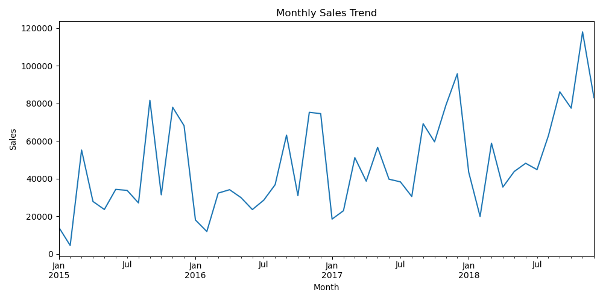
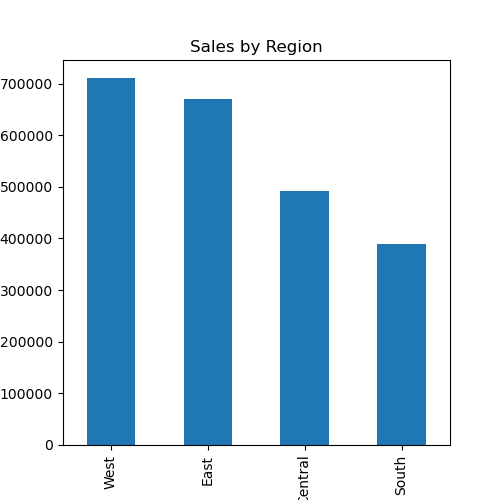
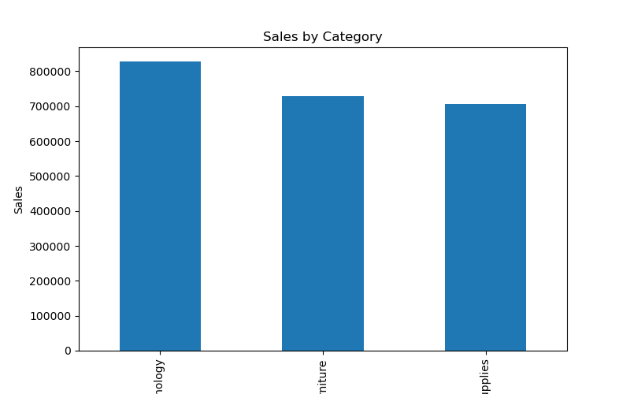

# 📊 Sales Analysis Project

## Project Overview
This project performs a comprehensive analysis of sales data to uncover trends, high-performing regions, categories, and sub-categories. It demonstrates data cleaning, aggregation, visualization, and business insight generation.

## Dataset
- Source: https://www.kaggle.com/datasets/rohitsahoo/sales-forecasting
- Key Columns: Order Date, Region, Category, Sub-Category, Sales, Quantity

## Tools & Skills
- Python (pandas, matplotlib, seaborn)
- Data Analysis, EDA, Visualization, Business Insights

## Key Insights
- West & East regions generate highest sales
- Technology is the top category
- Phones and Chairs are top sub-categories
- Sales trend shows seasonality

## Visualizations





## How to Run
```bash
pip install -r requirements.txt
jupyter notebook Sales_Analysis.ipynb
